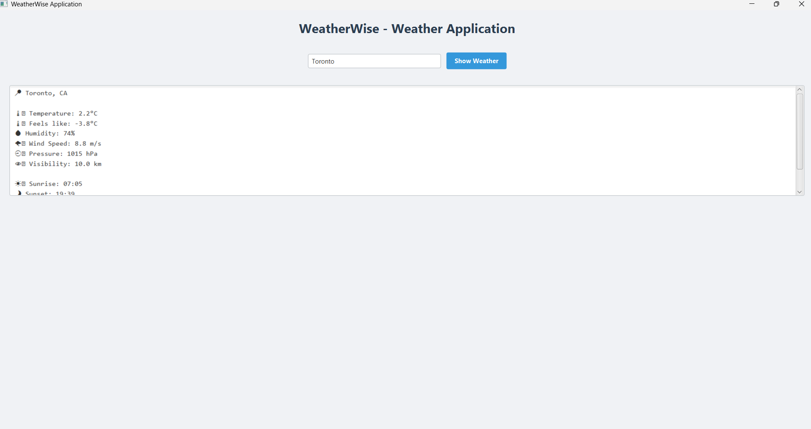

# WeatherWise Application

A modern and user-friendly weather application built with JavaFX that provides real-time weather information for cities worldwide. **Now with secure user authentication system!**

## 🔐 **NEW: Authentication System**

WeatherWiseApp now features a complete authentication system that allows users to create accounts, sign in securely, and manage their sessions. This transforms the app from a simple weather tool into a personalized weather experience.

### **Authentication Features:**
- ✅ **User Registration**: Create new accounts with username, email, and secure password
- ✅ **Secure Login**: Sign in with username/email and password
- ✅ **Session Management**: Automatic timeout after 30 minutes of inactivity
- ✅ **Secure Logout**: Properly end sessions and clear user data
- ✅ **Password Security**: BCrypt hashing for secure password storage
- ✅ **Input Validation**: Comprehensive validation for all user inputs
- ✅ **PostgreSQL Database**: Robust database for user data persistence with connection pooling

## Features

- 🔐 **User Authentication**: Secure login and signup system with session management
- 👤 **User Accounts**: Create and manage personal accounts with secure password storage
- 🔍 **City Search**: Easily search for any city worldwide
- 🌡️ **Temperature Data**: View current temperature and "feels like" temperature in Celsius
- 💧 **Humidity Information**: Check current humidity levels
- 🌪️ **Wind Speed**: Monitor wind conditions in meters per second
- ⏲️ **Atmospheric Pressure**: View pressure in hectopascals (hPa)
- 👁️ **Visibility**: Check visibility conditions in kilometers
- ☀️ **Sun Timings**: Track sunrise and sunset times
- 📱 **Modern UI**: Clean and intuitive user interface with emoji indicators
- ⚡ **Fast Response**: Quick weather data retrieval with caching system
- 🔄 **Auto-Refresh**: Weather data is cached for 5 minutes for optimal performance
- 🔒 **Session Management**: Automatic session timeout and secure logout functionality

## Installation

### Prerequisites
1. **Java 11 or later** installed
2. **PostgreSQL** database server installed and running
3. **Maven** for building the project

### Setup Steps
1. **Install PostgreSQL** (if not already installed):
   - Windows: Download from https://www.postgresql.org/download/windows/
   - macOS: `brew install postgresql`
   - Ubuntu/Debian: `sudo apt-get install postgresql postgresql-contrib`

2. **Set up the database**:
   ```bash
   # Run the PostgreSQL setup script
   psql -U postgres -f postgresql_setup.sql
   ```
   
   For detailed setup instructions, see [POSTGRESQL_SETUP.md](POSTGRESQL_SETUP.md)

3. **Clone the repository**:
   ```bash
   git clone https://github.com/ozgucdlg/WeatherWiseApp.git
   ```

4. **Navigate to the project directory**:
   ```bash
   cd WeatherWiseApp
   ```

5. **Build the project**:
   ```bash
   mvn clean install
   ```

6. **Run the application**:
   ```bash
   mvn javafx:run
   ```

> **Note**: For detailed PostgreSQL setup instructions, see [POSTGRESQL_SETUP.md](POSTGRESQL_SETUP.md)

## 🚀 **Getting Started**

### **First Time Setup:**
1. Launch the application
2. Click **"Create Account"** to register
3. Fill in your details:
   - Username (3-20 characters, letters, numbers, underscores)
   - Email address
   - Password (8+ characters, must contain letters and numbers)
   - Confirm password
4. Click **"Create Account"** to complete registration
5. You'll be redirected to the login screen

### **Returning Users:**
1. Launch the application
2. Enter your username or email
3. Enter your password
4. Click **"Sign In"** to access your account

### **Using the Weather App:**
1. After successful login, you'll see the main weather interface
2. Enter a city name in the search field
3. Click "Show Weather" or press Enter
4. View detailed weather information including:
   - Current temperature
   - Feels like temperature
   - Humidity percentage
   - Wind speed
   - Atmospheric pressure
   - Visibility
   - Sunrise and sunset times
   - Current weather conditions
5. Use the **"Logout"** button to securely end your session

### **Account Management Features:**
- 🔐 **Secure Registration**: Create accounts with validation
- 🔑 **Flexible Login**: Use username or email to sign in
- ⏰ **Session Timeout**: Automatic logout after 30 minutes of inactivity
- 🚪 **Secure Logout**: Properly end sessions and clear data
- 🛡️ **Password Security**: Industry-standard BCrypt hashing
- ✅ **Input Validation**: Real-time validation with helpful feedback

## 🛠️ **Technology Stack**

### **Core Technologies:**
- **Java 11** - Main programming language
- **JavaFX** - Modern GUI framework
- **PostgreSQL** - Robust database with connection pooling
- **HikariCP** - High-performance connection pool
- **Maven** - Dependency management and build tool

### **Weather API:**
- **OpenWeatherMap API** - Real-time weather data

### **Authentication & Security:**
- **PostgreSQL** - Robust database for user management and sessions
- **BCrypt** - Secure password hashing
- **Input Validation** - Comprehensive data validation
- **Session Management** - Secure user sessions

### **Data Processing:**
- **JSON** - API response parsing
- **SQL** - Database operations

## 🔒 **Security Features**

### **Authentication Security:**
- **Password Hashing**: BCrypt algorithm for secure password storage
- **Input Sanitization**: Protection against injection attacks
- **Session Management**: Secure session handling with timeout
- **Data Validation**: Comprehensive input validation
- **SQL Injection Protection**: Prepared statements for database operations

### **User Data Protection:**
- **PostgreSQL Database**: User data stored securely with connection pooling
- **Connection Pooling**: HikariCP for optimal database performance
- **Session Expiration**: Automatic logout for security
- **Secure Logout**: Complete session cleanup

## 📡 **API Reference**

The application uses the OpenWeatherMap API to fetch weather data. The following endpoints are used:

- Current Weather Data: `api.openweathermap.org/data/2.5/weather`

Parameters:
- `q`: City name
- `units`: Metric
- `lang`: en (English)
- `appid`: Your API key

## Contributing

1. Fork the repository
2. Create your feature branch (`git checkout -b feature/AmazingFeature`)
3. Commit your changes (`git commit -m 'Add some AmazingFeature'`)
4. Push to the branch (`git push origin feature/AmazingFeature`)
5. Open a Pull Request

## License

This project is licensed under the MIT License - see the [LICENSE](LICENSE) file for details.

## Acknowledgments

- Weather data provided by [OpenWeatherMap](https://openweathermap.org/)
- Icons and emojis for weather representation
- JavaFX community for GUI components

## 📸 **Screenshots**

### **Authentication Screens:**
*Coming soon - Login and Signup interface screenshots*

### **Main Application Interface:**


### **Key Features Showcase:**
- 🔐 **Secure Login Screen** - Professional authentication interface
- 📝 **User Registration** - Comprehensive signup form with validation
- 🌤️ **Weather Dashboard** - Clean, modern weather display
- 👤 **User Session** - Personalized experience with logout functionality

## Contact

Özgüç Dalgiç - [@ozgucdlg](https://github.com/ozgucdlg)

Project Link: [https://github.com/ozgucdlg/WeatherWiseApp](https://github.com/ozgucdlg/WeatherWiseApp)
